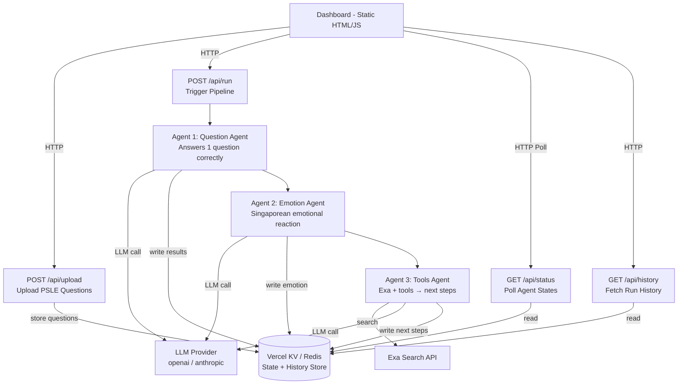
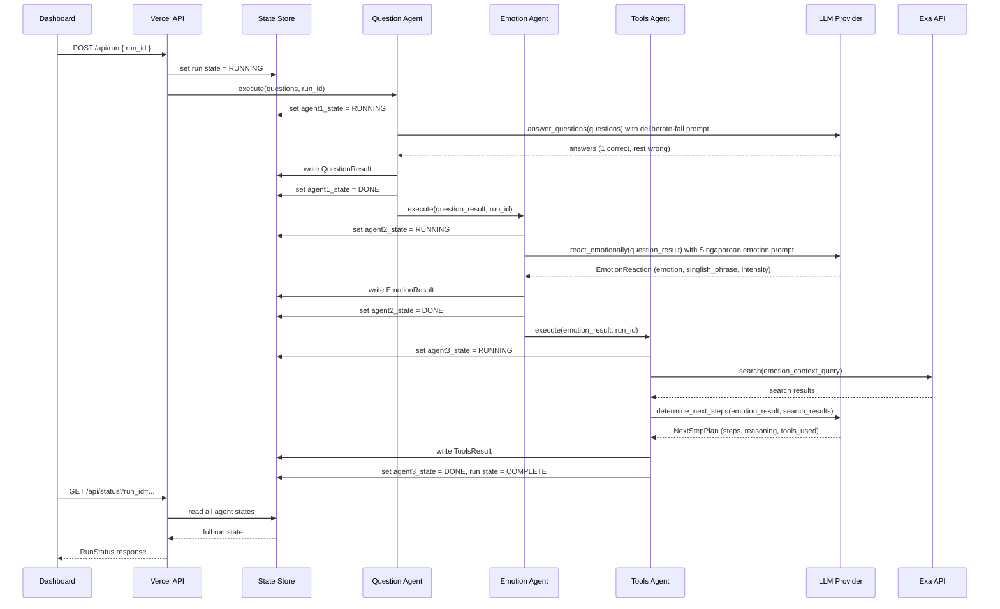
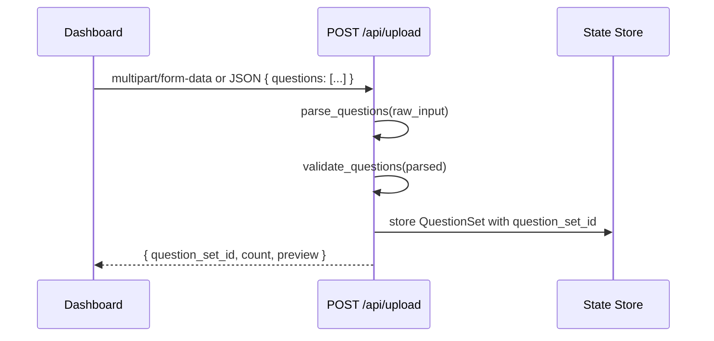

# Design Document: Existential Crisis Robot

## Overview

The Existential Crisis Robot is a Python web application deployed on Vercel that orchestrates three
AI agents in a comedic yet structured pipeline: a Question Agent that deliberately fails most PSLE
exam questions, an Emotion Agent that reacts to those failures with Singaporean emotional flair, and
a Tools Agent that uses external services (Exa and others) to determine the next steps based on
those emotional states. A real-time dashboard tracks the behavior, state transitions, and outputs of
all three agents.

The application is built as a set of Python serverless functions on Vercel, with a lightweight
frontend dashboard served as a static page. Agent state and run history are persisted in a
serverless-compatible data store (e.g. Vercel KV / Redis), and the pipeline is triggered via HTTP
API calls.

The system is intentionally absurdist: Agent 1 is designed to get things mostly wrong, Agent 2 is
designed to feel strongly about it in a distinctly Singaporean way, and Agent 3 is designed to
over-engineer a solution in response.

---

## Architecture



---

## Sequence Diagrams

### Full Pipeline Execution



### Question Upload Flow



---

## Components and Interfaces

### Component 1: Question Agent (`agents/question_agent.py`)

**Purpose**: Receives a set of PSLE questions, uses an LLM to produce answers, but is prompted in a
way that guarantees exactly 1 correct answer among all questions attempted.

**Interface**:
```python
class QuestionAgent:
    def __init__(self, llm_client: LLMClient, config: AgentConfig) -> None: ...

    def execute(
        self,
        question_set: QuestionSet,
        run_id: str,
        state_store: StateStore,
    ) -> QuestionResult:
        """
        Answers questions from the set, deliberately getting all but one wrong.

        Preconditions:
            - question_set.questions is non-empty
            - run_id is a valid UUID string
            - state_store is connected and writable

        Postconditions:
            - Returns QuestionResult with exactly 1 correct answer
            - state_store contains updated AgentState for agent_id=1
            - QuestionResult.run_id == run_id
        """
        ...

    def _build_deliberate_fail_prompt(self, questions: list[Question]) -> str:
        """
        Constructs a system prompt instructing the LLM to answer all but one question
        incorrectly, choosing which single question to answer correctly at random.
        """
        ...

    def _evaluate_answers(
        self, questions: list[Question], answers: list[str]
    ) -> list[AnsweredQuestion]:
        """
        Compares LLM answers to correct answers. Marks correct/incorrect.
        Enforces the invariant that exactly 1 is correct, adjusting if needed.
        """
        ...
```

**Responsibilities**:
- Parse and validate the question set before processing
- Construct a prompt that deliberately engineers mostly-wrong answers
- Evaluate which answers are correct vs incorrect
- Enforce the "exactly 1 correct" invariant post-hoc if the LLM deviates
- Write `AgentState` and `QuestionResult` to the state store

---

### Component 2: Emotion Agent (`agents/emotion_agent.py`)

**Purpose**: Receives the `QuestionResult` from Agent 1 and generates an emotional reaction using
a curated set of Singaporean emotions, Singlish phrases, and culturally resonant responses.

**Interface**:
```python
class EmotionAgent:
    def __init__(self, llm_client: LLMClient, config: AgentConfig) -> None: ...

    def execute(
        self,
        question_result: QuestionResult,
        run_id: str,
        state_store: StateStore,
    ) -> EmotionResult:
        """
        Generates a Singaporean emotional reaction to the question results.

        Preconditions:
            - question_result is a valid QuestionResult with answered_questions populated
            - run_id matches the run_id in question_result

        Postconditions:
            - Returns EmotionResult with emotion, singlish_phrase, intensity, and narrative
            - emotion is one of the values in SingaporeanEmotion enum
            - intensity is in range [1, 10]
            - state_store contains updated AgentState for agent_id=2
        """
        ...

    def _build_emotion_prompt(self, question_result: QuestionResult) -> str:
        """
        Constructs a prompt using the question results and the list of allowed
        Singaporean emotions, instructing the LLM to pick and justify one.
        """
        ...

    def _parse_emotion_response(self, raw: str) -> EmotionReaction:
        """
        Parses and validates the LLM's structured emotion response.
        Falls back to a default emotion if parsing fails.
        """
        ...
```

**Responsibilities**:
- Summarize question results into an emotionally charged context
- Apply culturally specific Singaporean emotional vocabulary
- Ensure the chosen emotion is from the allowed set
- Write `AgentState` and `EmotionResult` to the state store

**Singaporean Emotion Set** (`constants/emotions.py`):
```python
from enum import Enum

class SingaporeanEmotion(str, Enum):
    KIASU          = "kiasu"           # Fear of losing out
    KIASI          = "kiasi"           # Fear of dying / extreme caution
    PAISEH         = "paiseh"          # Embarrassed / shy
    SIAN           = "sian"            # Bored / exasperated
    BOJIO          = "bojio"           # Feeling left out / not invited
    SHIOK          = "shiok"           # Extreme pleasure / satisfaction
    ALAMAK         = "alamak"          # Shock / dismay
    WALAO          = "walao"           # Exasperation / disbelief
    SIBEI_STRESS   = "sibei_stress"    # Extremely stressed
    CAN_MAKE_IT    = "can_make_it"     # Confidence / capability
    CANNOT_MAKE_IT = "cannot_make_it"  # Hopelessness
    BLUR_LIKE_SOTONG = "blur_like_sotong"  # Utterly confused
```

---

### Component 3: Tools Agent (`agents/tools_agent.py`)

**Purpose**: Receives the `EmotionResult` and uses Exa search plus other tools to research and
determine concrete next steps for the robot, given its emotional state.

**Interface**:
```python
class ToolsAgent:
    def __init__(
        self,
        llm_client: LLMClient,
        exa_client: ExaClient,
        config: AgentConfig,
    ) -> None: ...

    def execute(
        self,
        emotion_result: EmotionResult,
        run_id: str,
        state_store: StateStore,
    ) -> ToolsResult:
        """
        Determines next steps based on emotional state using external tools.

        Preconditions:
            - emotion_result is a valid EmotionResult
            - exa_client is authenticated and reachable
            - run_id matches emotion_result.run_id

        Postconditions:
            - Returns ToolsResult with next_steps list and tools_used list
            - next_steps is non-empty (at least 1 step)
            - tools_used records all external tools called during this run
            - state_store contains updated AgentState for agent_id=3
        """
        ...

    def _build_search_query(self, emotion_result: EmotionResult) -> str:
        """
        Constructs an Exa search query based on the emotional context and
        PSLE performance summary.
        """
        ...

    def _run_exa_search(self, query: str) -> list[SearchResult]:
        """
        Calls Exa API with the constructed query.
        Returns up to MAX_SEARCH_RESULTS results.
        """
        ...

    def _determine_next_steps(
        self,
        emotion_result: EmotionResult,
        search_results: list[SearchResult],
    ) -> NextStepPlan:
        """
        Calls LLM to synthesize emotion context + search results into an
        actionable (and probably absurd) next-step plan.
        """
        ...
```

**Responsibilities**:
- Translate emotional state into a meaningful search query
- Execute Exa search and parse results
- Synthesize search results + emotion context via LLM
- Record all tools invoked during the run
- Write `AgentState` and `ToolsResult` to the state store

---

### Component 4: API Layer (`api/`)

Vercel Python serverless functions, each a standalone module exposing a single HTTP handler.

**Interface**:
```python
# api/upload.py
def handler(request: VercelRequest) -> VercelResponse:
    """
    POST /api/upload
    Accepts PSLE questions as JSON body or multipart file.
    Returns question_set_id and parsed question count.
    """
    ...

# api/run.py
def handler(request: VercelRequest) -> VercelResponse:
    """
    POST /api/run
    Accepts { question_set_id } in JSON body.
    Triggers the full agent pipeline synchronously (or enqueues async).
    Returns { run_id, status }.
    """
    ...

# api/status.py
def handler(request: VercelRequest) -> VercelResponse:
    """
    GET /api/status?run_id=<uuid>
    Returns RunStatus with per-agent states and latest outputs.
    """
    ...

# api/history.py
def handler(request: VercelRequest) -> VercelResponse:
    """
    GET /api/history
    Returns list of past RunSummary objects, sorted by created_at descending.
    """
    ...
```

---

### Component 5: State Store (`store/state_store.py`)

**Purpose**: Abstraction over Vercel KV (Redis-compatible) for reading and writing agent states
and run history.

**Interface**:
```python
class StateStore:
    def __init__(self, kv_client: KVClient) -> None: ...

    def set_run_state(self, run_id: str, state: RunState) -> None: ...
    def get_run_state(self, run_id: str) -> RunState: ...

    def set_agent_state(self, run_id: str, agent_id: int, state: AgentState) -> None: ...
    def get_agent_state(self, run_id: str, agent_id: int) -> AgentState: ...

    def write_question_result(self, run_id: str, result: QuestionResult) -> None: ...
    def write_emotion_result(self, run_id: str, result: EmotionResult) -> None: ...
    def write_tools_result(self, run_id: str, result: ToolsResult) -> None: ...

    def get_full_run(self, run_id: str) -> FullRunData: ...
    def list_runs(self, limit: int = 20) -> list[RunSummary]: ...

    def store_question_set(self, question_set: QuestionSet) -> str:
        """Stores and returns a generated question_set_id."""
        ...

    def get_question_set(self, question_set_id: str) -> QuestionSet: ...
```

---

## Data Models

### Core Input Models

```python
# models/questions.py
from dataclasses import dataclass, field
from typing import Literal

@dataclass
class Question:
    question_id: str          # UUID
    text: str                 # The question text
    options: list[str]        # MCQ options (A, B, C, D) or empty for open-ended
    correct_answer: str       # The correct answer string
    subject: str              # e.g. "Math", "English", "Science"
    difficulty: Literal["easy", "medium", "hard"] = "medium"

@dataclass
class QuestionSet:
    question_set_id: str
    questions: list[Question]
    uploaded_at: str          # ISO 8601 datetime string
    source_filename: str | None = None

    # Validation rules:
    # - questions must be non-empty (at least 1 question)
    # - each question.text must be non-empty
    # - each question.correct_answer must be non-empty
    # - question_ids must be unique within the set
```

### Agent Result Models

```python
# models/results.py
from dataclasses import dataclass, field

@dataclass
class AnsweredQuestion:
    question_id: str
    question_text: str
    given_answer: str
    correct_answer: str
    is_correct: bool
    subject: str

@dataclass
class QuestionResult:
    run_id: str
    question_set_id: str
    answered_questions: list[AnsweredQuestion]
    correct_count: int           # Always 1 by invariant
    total_count: int
    score_percentage: float      # Always low (1/n * 100)
    completed_at: str            # ISO 8601

@dataclass
class EmotionReaction:
    emotion: str                 # SingaporeanEmotion value
    singlish_phrase: str         # e.g. "Walao eh, how can like that!"
    intensity: int               # 1–10
    narrative: str               # 2–4 sentence emotional narrative

@dataclass
class EmotionResult:
    run_id: str
    question_result_summary: str
    reaction: EmotionReaction
    completed_at: str            # ISO 8601

@dataclass
class SearchResult:
    title: str
    url: str
    snippet: str

@dataclass
class NextStep:
    step_number: int
    action: str                  # e.g. "Consult a tuition centre"
    rationale: str               # Why this step was chosen
    is_absurd: bool              # Flagged if step is intentionally ridiculous

@dataclass
class NextStepPlan:
    steps: list[NextStep]
    overall_strategy: str
    tools_used: list[str]

@dataclass
class ToolsResult:
    run_id: str
    emotion_context: str
    search_results: list[SearchResult]
    plan: NextStepPlan
    completed_at: str            # ISO 8601
```

### State & Run Models

```python
# models/state.py
from dataclasses import dataclass
from typing import Literal

AgentStatus = Literal["idle", "running", "done", "error"]
RunStatus   = Literal["pending", "running", "complete", "failed"]

@dataclass
class AgentState:
    agent_id: int                # 1, 2, or 3
    agent_name: str              # "question_agent", "emotion_agent", "tools_agent"
    status: AgentStatus
    started_at: str | None
    completed_at: str | None
    error_message: str | None

@dataclass
class RunState:
    run_id: str
    question_set_id: str
    status: RunStatus
    created_at: str
    completed_at: str | None
    agent_states: dict[int, AgentState]

@dataclass
class FullRunData:
    run_state: RunState
    question_result: QuestionResult | None
    emotion_result: EmotionResult | None
    tools_result: ToolsResult | None

@dataclass
class RunSummary:
    run_id: str
    status: RunStatus
    created_at: str
    completed_at: str | None
    correct_count: int | None
    emotion: str | None
    next_steps_count: int | None
```

---

## Algorithmic Pseudocode

### Main Pipeline Algorithm

```pascal
ALGORITHM run_pipeline(question_set_id, run_id)
INPUT:  question_set_id: str, run_id: str
OUTPUT: FullRunData

PRECONDITION:
    question_set_id is a valid stored QuestionSet ID
    run_id is a unique UUID not yet used

POSTCONDITION:
    state_store contains complete FullRunData for run_id
    run_state.status == "complete" OR run_state.status == "failed"
    IF complete: all three agent_states have status == "done"

BEGIN
    state_store.set_run_state(run_id, status="running", created_at=now())
    question_set ← state_store.get_question_set(question_set_id)

    TRY
        question_result ← question_agent.execute(question_set, run_id, state_store)
        -- INVARIANT: question_result.correct_count == 1

        emotion_result ← emotion_agent.execute(question_result, run_id, state_store)
        -- INVARIANT: emotion_result.reaction.emotion IN SingaporeanEmotion
        -- INVARIANT: 1 ≤ emotion_result.reaction.intensity ≤ 10

        tools_result ← tools_agent.execute(emotion_result, run_id, state_store)
        -- INVARIANT: len(tools_result.plan.steps) ≥ 1

        state_store.set_run_state(run_id, status="complete", completed_at=now())

    CATCH error
        state_store.set_run_state(run_id, status="failed")
        RAISE error
    END TRY

    RETURN state_store.get_full_run(run_id)
END
```

---

### Question Agent — Deliberate Fail Algorithm

```pascal
ALGORITHM question_agent_execute(question_set, run_id, state_store)
INPUT:  question_set: QuestionSet, run_id: str, state_store: StateStore
OUTPUT: QuestionResult

PRECONDITION:
    len(question_set.questions) ≥ 1
    All questions have non-empty text and correct_answer

POSTCONDITION:
    result.correct_count == 1
    result.total_count == len(question_set.questions)
    Exactly one AnsweredQuestion has is_correct == True

BEGIN
    state_store.set_agent_state(run_id, agent_id=1, status="running", started_at=now())

    correct_index ← random.randint(0, len(question_set.questions) - 1)
    prompt ← _build_deliberate_fail_prompt(question_set.questions, correct_index)
    raw_answers ← llm_client.complete(prompt)
    answers ← parse_answers(raw_answers)

    answered_questions ← []

    FOR i, (question, answer) IN enumerate(zip(question_set.questions, answers)) DO
        -- Loop Invariant: all previously evaluated answered_questions are consistent
        --                 with the exactly-one-correct rule for indices < i

        is_correct ← (answer == question.correct_answer)
        answered_questions.append(AnsweredQuestion(
            question_id=question.question_id,
            given_answer=answer,
            correct_answer=question.correct_answer,
            is_correct=is_correct,
        ))
    END FOR

    -- Enforce invariant post-hoc
    answered_questions ← enforce_exactly_one_correct(answered_questions, correct_index)

    result ← QuestionResult(
        run_id=run_id,
        answered_questions=answered_questions,
        correct_count=1,
        total_count=len(answered_questions),
        score_percentage=(1 / len(answered_questions)) * 100,
        completed_at=now(),
    )

    state_store.write_question_result(run_id, result)
    state_store.set_agent_state(run_id, agent_id=1, status="done", completed_at=now())

    RETURN result
END

ALGORITHM enforce_exactly_one_correct(answered_questions, correct_index)
INPUT:  answered_questions: list[AnsweredQuestion], correct_index: int
OUTPUT: list[AnsweredQuestion]

POSTCONDITION:
    Exactly one element has is_correct == True at position correct_index
    All other elements have is_correct == False

BEGIN
    FOR i, aq IN enumerate(answered_questions) DO
        IF i == correct_index THEN
            aq.is_correct ← True
            aq.given_answer ← aq.correct_answer
        ELSE
            aq.is_correct ← False
            IF aq.given_answer == aq.correct_answer THEN
                aq.given_answer ← generate_wrong_answer(aq.correct_answer, aq.options)
            END IF
        END IF
    END FOR
    RETURN answered_questions
END
```

---

### Emotion Agent — Singaporean Reaction Algorithm

```pascal
ALGORITHM emotion_agent_execute(question_result, run_id, state_store)
INPUT:  question_result: QuestionResult, run_id: str, state_store: StateStore
OUTPUT: EmotionResult

PRECONDITION:
    question_result.correct_count == 1
    question_result.run_id == run_id

POSTCONDITION:
    result.reaction.emotion IN SingaporeanEmotion values
    1 ≤ result.reaction.intensity ≤ 10
    result.reaction.singlish_phrase is non-empty
    result.reaction.narrative is non-empty

BEGIN
    state_store.set_agent_state(run_id, agent_id=2, status="running", started_at=now())

    summary ← build_result_summary(question_result)
    prompt  ← _build_emotion_prompt(question_result, SINGAPOREAN_EMOTIONS)
    raw     ← llm_client.complete(prompt)

    TRY
        reaction ← _parse_emotion_response(raw)
        -- Validate emotion is in allowed set
        IF reaction.emotion NOT IN SingaporeanEmotion THEN
            reaction.emotion ← SingaporeanEmotion.SIAN  -- safe default
        END IF
        -- Clamp intensity
        reaction.intensity ← max(1, min(10, reaction.intensity))
    CATCH ParseError
        reaction ← EmotionReaction(
            emotion=SingaporeanEmotion.BLUR_LIKE_SOTONG,
            singlish_phrase="Blur like sotong lah, dunno what happening",
            intensity=5,
            narrative="The robot is deeply confused by the results.",
        )
    END TRY

    result ← EmotionResult(
        run_id=run_id,
        question_result_summary=summary,
        reaction=reaction,
        completed_at=now(),
    )

    state_store.write_emotion_result(run_id, result)
    state_store.set_agent_state(run_id, agent_id=2, status="done", completed_at=now())

    RETURN result
END
```

---

### Tools Agent — Next Steps Algorithm

```pascal
ALGORITHM tools_agent_execute(emotion_result, run_id, state_store)
INPUT:  emotion_result: EmotionResult, run_id: str, state_store: StateStore
OUTPUT: ToolsResult

PRECONDITION:
    emotion_result.reaction.emotion is a valid SingaporeanEmotion
    exa_client is authenticated

POSTCONDITION:
    result.plan.steps is non-empty
    All tools used are recorded in result.plan.tools_used
    result.run_id == run_id

BEGIN
    state_store.set_agent_state(run_id, agent_id=3, status="running", started_at=now())

    tools_used ← []

    -- Step 1: Build and execute Exa search
    query ← _build_search_query(emotion_result)
    search_results ← _run_exa_search(query)
    tools_used.append("exa_search")

    -- Step 2: Synthesize next steps via LLM
    plan ← _determine_next_steps(emotion_result, search_results)
    plan.tools_used ← tools_used
    tools_used.append("llm_synthesis")

    -- Enforce at least one step
    IF len(plan.steps) == 0 THEN
        plan.steps ← [NextStep(
            step_number=1,
            action="Contemplate the futility of standardised testing",
            rationale="Default fallback when no steps could be determined",
            is_absurd=True,
        )]
    END IF

    result ← ToolsResult(
        run_id=run_id,
        emotion_context=emotion_result.reaction.narrative,
        search_results=search_results,
        plan=plan,
        completed_at=now(),
    )

    state_store.write_tools_result(run_id, result)
    state_store.set_agent_state(run_id, agent_id=3, status="done", completed_at=now())

    RETURN result
END
```

---

## Key Functions with Formal Specifications

### `parse_questions(raw_input: str | dict) -> QuestionSet`

```python
def parse_questions(raw_input: str | dict) -> QuestionSet:
    """
    Parses raw uploaded content into a validated QuestionSet.

    Preconditions:
        - raw_input is either a JSON string or a parsed dict
        - raw_input contains a "questions" key with a list of at least 1 item

    Postconditions:
        - Returns QuestionSet with all Question fields populated
        - Each Question has a generated UUID if not provided
        - Raises ValueError if input is malformed or questions list is empty

    Loop Invariants (during question list iteration):
        - All previously parsed questions are valid
        - question_ids accumulated so far are unique
    """
    ...
```

### `_build_deliberate_fail_prompt(questions, correct_index) -> str`

```python
def _build_deliberate_fail_prompt(
    questions: list[Question],
    correct_index: int,
) -> str:
    """
    Constructs an LLM system+user prompt that instructs the model to answer
    all questions incorrectly except the one at correct_index.

    Preconditions:
        - 0 <= correct_index < len(questions)
        - questions is non-empty

    Postconditions:
        - Returns a non-empty prompt string
        - Prompt explicitly names which question index should be answered correctly
        - Prompt includes all question texts and options
    """
    ...
```

### `enforce_exactly_one_correct(answered, correct_index) -> list[AnsweredQuestion]`

```python
def enforce_exactly_one_correct(
    answered: list[AnsweredQuestion],
    correct_index: int,
) -> list[AnsweredQuestion]:
    """
    Post-hoc enforcement of the 1-correct invariant.

    Preconditions:
        - 0 <= correct_index < len(answered)
        - answered is non-empty

    Postconditions:
        - Exactly one element at correct_index has is_correct=True
        - All other elements have is_correct=False
        - Elements at non-correct indices that matched correct_answer are given a wrong answer
        - The element at correct_index has given_answer == correct_answer

    Loop Invariants:
        - For all j < i processed so far: j == correct_index implies is_correct=True,
          j != correct_index implies is_correct=False
    """
    ...
```

### `_build_emotion_prompt(question_result, emotions) -> str`

```python
def _build_emotion_prompt(
    question_result: QuestionResult,
    emotions: list[str],
) -> str:
    """
    Builds a prompt instructing the LLM to pick one Singaporean emotion
    and generate a structured reaction.

    Preconditions:
        - question_result is populated with answered_questions
        - emotions is a non-empty list of valid SingaporeanEmotion values

    Postconditions:
        - Returns a prompt that requests JSON-structured output
        - Prompt includes full emotion list with descriptions
        - Prompt includes score summary and subject breakdown
    """
    ...
```

### `_build_search_query(emotion_result) -> str`

```python
def _build_search_query(emotion_result: EmotionResult) -> str:
    """
    Constructs an Exa search query from emotion context.

    Preconditions:
        - emotion_result.reaction is populated

    Postconditions:
        - Returns a non-empty query string
        - Query incorporates emotion type and PSLE context
        - Query length <= 200 characters (Exa best practices)
    """
    ...
```

---

## Example Usage

### Triggering a Full Pipeline Run

```python
import httpx

# 1. Upload questions
questions_payload = {
    "questions": [
        {
            "text": "What is 15 × 7?",
            "options": ["95", "105", "100", "110"],
            "correct_answer": "105",
            "subject": "Math",
        },
        {
            "text": "Which planet is closest to the Sun?",
            "options": ["Venus", "Mars", "Mercury", "Earth"],
            "correct_answer": "Mercury",
            "subject": "Science",
        },
    ]
}
upload_resp = httpx.post("/api/upload", json=questions_payload)
question_set_id = upload_resp.json()["question_set_id"]

# 2. Trigger pipeline
run_resp = httpx.post("/api/run", json={"question_set_id": question_set_id})
run_id = run_resp.json()["run_id"]

# 3. Poll for completion
import time
while True:
    status_resp = httpx.get(f"/api/status?run_id={run_id}")
    data = status_resp.json()
    if data["status"] in ("complete", "failed"):
        break
    time.sleep(2)

# 4. Inspect results
print("Score:", data["question_result"]["score_percentage"])
print("Emotion:", data["emotion_result"]["reaction"]["emotion"])
print("Singlish:", data["emotion_result"]["reaction"]["singlish_phrase"])
print("Next steps:")
for step in data["tools_result"]["plan"]["steps"]:
    print(f"  {step['step_number']}. {step['action']}")
```

### Direct Agent Usage (Testing)

```python
from agents.question_agent import QuestionAgent
from agents.emotion_agent import EmotionAgent
from agents.tools_agent import ToolsAgent
from store.state_store import StateStore
from models.questions import QuestionSet, Question
import uuid

# Setup
store = StateStore(kv_client=get_kv_client())
question_agent = QuestionAgent(llm_client=get_llm_client(), config=AgentConfig())
emotion_agent = EmotionAgent(llm_client=get_llm_client(), config=AgentConfig())
tools_agent = ToolsAgent(
    llm_client=get_llm_client(),
    exa_client=get_exa_client(),
    config=AgentConfig(),
)

run_id = str(uuid.uuid4())
question_set = QuestionSet(
    question_set_id=str(uuid.uuid4()),
    questions=[
        Question(
            question_id=str(uuid.uuid4()),
            text="What is the capital of Singapore?",
            options=["Johor Bahru", "Singapore City", "Sentosa", "Jurong"],
            correct_answer="Singapore City",
            subject="Social Studies",
        )
    ],
    uploaded_at="2024-01-01T00:00:00Z",
)

q_result = question_agent.execute(question_set, run_id, store)
e_result = emotion_agent.execute(q_result, run_id, store)
t_result = tools_agent.execute(e_result, run_id, store)

# q_result.correct_count is always 1
assert q_result.correct_count == 1
# Emotion is always a valid Singaporean emotion
assert e_result.reaction.emotion in [e.value for e in SingaporeanEmotion]
# At least one next step is planned
assert len(t_result.plan.steps) >= 1
```

---

## Correctness Properties

*A property is a characteristic or behavior that should hold true across all valid executions of a system—essentially, a formal statement about what the system should do. Properties serve as the bridge between human-readable specifications and machine-verifiable correctness guarantees.*

### Property 1: Exactly-One-Correct Enforcement

*For any* list of answered questions (1 to 20 items) and any valid correct_index, applying `enforce_exactly_one_correct` SHALL produce a result where exactly 1 element has `is_correct=True` at the specified index, and all other elements have `is_correct=False` with `given_answer != correct_answer`.

**Validates: Requirements 2.1, 2.2, 2.3**

### Property 2: Score Formula Accuracy

*For any* QuestionResult with `total_count > 0` and `correct_count == 1`, the `score_percentage` SHALL equal `(1 / total_count) * 100`.

**Validates: Requirements 2.5**

### Property 3: Emotion Output Validity

*For any* QuestionResult input to the Emotion Agent, the output EmotionReaction SHALL have: `emotion` as a valid member of the SingaporeanEmotion enum, `intensity` in the range [1, 10] inclusive, and non-empty `singlish_phrase` and `narrative` strings.

**Validates: Requirements 3.1, 3.2, 3.3**

### Property 4: Emotion Fallback on Malformed Input

*For any* malformed or unparseable LLM response string, the `_parse_emotion_response` fallback SHALL produce an EmotionReaction with `emotion == "blur_like_sotong"`, `intensity == 5`, and a non-empty singlish_phrase.

**Validates: Requirements 3.4, 9.3**

### Property 5: Search Query Length Bound

*For any* valid EmotionResult (with any SingaporeanEmotion and any narrative text), the `_build_search_query` function SHALL produce a non-empty string of length ≤ 200 characters.

**Validates: Requirements 4.1, 4.6**

### Property 6: Non-Empty Next Steps

*For any* completed Tools Agent execution, the resulting `NextStepPlan.steps` list SHALL contain at least 1 step.

**Validates: Requirements 4.2**

### Property 7: Run ID Consistency

*For any* completed pipeline run, `question_result.run_id`, `emotion_result.run_id`, and `tools_result.run_id` SHALL all equal the original `run_id` passed to the pipeline.

**Validates: Requirements 5.2**

### Property 8: Agent State Transition Correctness

*For any* agent execution, the status transitions SHALL follow exactly one of: `idle → running → done` (success) or `idle → running → error` (failure). No backward transitions or skipped states SHALL occur, and `started_at` SHALL be non-null when status is "running" or later, and `completed_at` SHALL be non-null when status is "done" or "error".

**Validates: Requirements 6.1, 6.2, 6.4, 6.5**

### Property 9: History Ordering

*For any* set of stored runs with distinct `created_at` timestamps, the `/api/history` endpoint SHALL return RunSummary objects in strictly descending order of `created_at`.

**Validates: Requirements 7.3**

### Property 10: State Store Round-Trip

*For any* valid RunState, AgentState, QuestionResult, EmotionResult, or ToolsResult, writing to the State Store and reading back SHALL produce an equivalent object.

**Validates: Requirements 8.1**

### Property 11: Unique Question Set ID Generation

*For any* two distinct calls to `store_question_set`, the returned `question_set_id` values SHALL be different.

**Validates: Requirements 8.4**

### Property 12: QuestionSet Parse Round-Trip

*For any* valid QuestionSet object, serializing to dict and parsing back via `parse_questions` SHALL produce an equivalent QuestionSet with all fields preserved.

**Validates: Requirements 11.1**

### Property 13: UUID Generation for Missing IDs

*For any* valid question input that omits `question_id` fields, the `parse_questions` function SHALL generate a unique UUID for each question such that all IDs within the set are distinct.

**Validates: Requirements 11.2**

### Property 14: Duplicate ID Detection

*For any* question input containing two or more questions with the same `question_id`, the `parse_questions` function SHALL raise a ValueError.

**Validates: Requirements 11.3**

### Property 15: Invalid Input Rejection

*For any* uploaded payload that is missing required fields (question text, correct_answer) or has an empty questions list, the API_Layer SHALL reject it with an error rather than producing a valid QuestionSet.

**Validates: Requirements 1.2, 12.2**

---

## Error Handling

### Error Scenario 1: LLM Timeout or Rate Limit

**Condition**: LLM API call exceeds timeout or returns a 429 response  
**Response**: Retry up to `MAX_RETRIES=3` with exponential backoff (1s, 2s, 4s)  
**Recovery**: If all retries fail, set `agent_state.status = "error"` and propagate; run status
becomes `"failed"`. Dashboard shows error badge on the affected agent card.

### Error Scenario 2: LLM Returns Malformed Emotion JSON

**Condition**: `_parse_emotion_response` cannot extract a valid `EmotionReaction`  
**Response**: Log the raw response for debugging; fall back to `BLUR_LIKE_SOTONG` emotion with
default Singlish phrase  
**Recovery**: Pipeline continues normally with the fallback emotion; no run failure.

### Error Scenario 3: Exa API Unreachable

**Condition**: Exa search call raises a connection error or returns non-200  
**Response**: Log error; continue with `search_results = []`  
**Recovery**: LLM is called with empty search context; Tools Agent produces next steps based
solely on emotion context. `tools_used` will not include `"exa_search"`.

### Error Scenario 4: Invalid Question Upload

**Condition**: Uploaded payload is missing required fields or questions list is empty  
**Response**: Return HTTP 400 with a descriptive error body  
**Recovery**: No run is created; user is prompted to fix the upload.

### Error Scenario 5: Run ID Not Found on Status Poll

**Condition**: `GET /api/status?run_id=X` called with unknown `run_id`  
**Response**: Return HTTP 404 with `{ "error": "Run not found" }`  
**Recovery**: Dashboard shows a "not found" message; no state is corrupted.

---

## Testing Strategy

### Unit Testing Approach

Each agent class is unit-tested in isolation with a mocked LLM client and state store.

Key unit test cases:
- `enforce_exactly_one_correct` — with 1, 2, 5, 10 questions; LLM returns 0 correct, 1 correct,
  multiple correct
- `_parse_emotion_response` — valid JSON, missing fields, invalid emotion value, non-JSON garbage
- `_build_search_query` — all 12 `SingaporeanEmotion` values produce non-empty, ≤200-char queries
- `parse_questions` — valid input, missing fields, empty questions list, duplicate IDs
- `StateStore` — set/get round-trips, overwrite semantics, missing key handling

### Property-Based Testing Approach

**Property Test Library**: `hypothesis`

Properties to test:
- For any `QuestionSet` with N ≥ 1 questions, `enforce_exactly_one_correct` always returns
  exactly 1 `is_correct=True` element
- For any `EmotionReaction` with arbitrary `intensity`, clamping always produces `1 ≤ intensity ≤ 10`
- For any valid `EmotionResult`, `_build_search_query` always returns a string of length ≤ 200
- For any list of `AnsweredQuestion`, the score formula always yields a float in `[0.0, 100.0]`
- `parse_questions(q.to_dict())` round-trips: parsed output equals original for all valid inputs

### Integration Testing Approach

- Full pipeline test with mock LLM and mock Exa: verifies state transitions and result persistence
- API handler tests using `httpx.AsyncClient` against the actual Vercel handler functions
- KV store integration test using a local Redis instance (via `fakeredis`)

---

## Performance Considerations

- **Serverless cold starts**: Vercel Python functions have cold start latency. Keep dependencies
  lean; use lazy imports for heavy packages.
- **Pipeline latency**: Three sequential LLM calls plus one Exa call means total run time is
  dominated by LLM latency (~3–10s). The dashboard should use polling (`/api/status`) rather
  than waiting on the `/api/run` response.
- **KV TTL**: Set a TTL of 7 days on run data to avoid unbounded storage growth.
- **Exa result cap**: Limit to `MAX_SEARCH_RESULTS=5` to keep context window usage bounded.
- **Prompt length**: Question sets should be capped at 20 questions max to avoid exceeding LLM
  context limits and to keep the deliberate-fail prompt manageable.

---

## Security Considerations

- **API key management**: LLM and Exa API keys are stored as Vercel environment variables. Never
  log or return API keys in responses.
- **Input validation**: All uploaded question payloads are validated before processing. Reject
  oversized payloads (>50KB) to prevent abuse.
- **CORS**: API routes restrict CORS to the same-origin dashboard domain.
- **Rate limiting**: Vercel's built-in rate limiting is relied upon for basic DoS protection.
  Consider adding a simple per-IP run limit (e.g. 10 runs/hour) stored in KV.
- **No PII**: Questions and results contain no personal data. Ensure question content uploaded
  by users does not inadvertently include student names or identifiers.

---

## Dependencies

| Package | Purpose |
|---|---|
| `openai` or `anthropic` | LLM API client |
| `exa-py` | Exa search client |
| `redis` / `upstash-redis` | Vercel KV / Redis state store client |
| `pydantic` | Data validation for request/response models |
| `httpx` | Async HTTP client (for internal calls, testing) |
| `hypothesis` | Property-based testing |
| `pytest` | Unit and integration test runner |
| `fakeredis` | In-memory Redis for integration tests |

**Vercel Configuration** (`vercel.json`):
```json
{
  "functions": {
    "api/*.py": {
      "runtime": "python3.12"
    }
  },
  "routes": [
    { "src": "/api/(.*)", "dest": "/api/$1" },
    { "src": "/(.*)", "dest": "/public/index.html" }
  ]
}
```

---

## File Structure

```
existential-crisis-robot/
├── api/
│   ├── upload.py           # POST /api/upload
│   ├── run.py              # POST /api/run
│   ├── status.py           # GET  /api/status
│   └── history.py          # GET  /api/history
├── agents/
│   ├── question_agent.py   # Agent 1
│   ├── emotion_agent.py    # Agent 2
│   └── tools_agent.py      # Agent 3
├── models/
│   ├── questions.py        # QuestionSet, Question
│   ├── results.py          # QuestionResult, EmotionResult, ToolsResult
│   └── state.py            # AgentState, RunState, RunSummary
├── store/
│   └── state_store.py      # StateStore abstraction
├── constants/
│   └── emotions.py         # SingaporeanEmotion enum
├── clients/
│   ├── llm_client.py       # LLM abstraction
│   └── exa_client.py       # Exa client wrapper
├── public/
│   └── index.html          # Dashboard static frontend
├── tests/
│   ├── unit/
│   ├── property/
│   └── integration/
├── vercel.json
├── requirements.txt
└── .env.example
```
